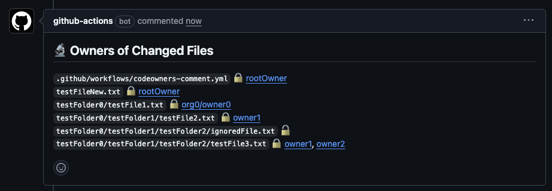

# codeowners-comment-action

This action posts a comment to the pull request like this:



This helps you to quickly find which users or teams to ask for a review, because you can instantly see the owners of every changed file in a pull request.

## Usage

You can use the action like this:

```yaml
name: Codeowners Comment
on:
  pull_request:
permissions:
  contents: read
  pull-requests: write
jobs:
  post-codeowners-comment:
    runs-on: ubuntu-24.04
    steps:
      - name: Checkout
        uses: actions/checkout@v5
      - name: Use Node.js
        uses: actions/setup-node@v6
        with:
          node-version: 24.10.0
      - name: Post comment
        uses: elias-pap/codeowners-comment-action@v0.0.1
```

## Limitations

Currently, up to 3000 changed files are supported. If a PR changes more than 3000 files, some files might not appear in the comment.

## Troubleshooting

If you think the action is not working properly, you can enable [debug logging](https://github.blog/changelog/2022-05-24-github-actions-re-run-jobs-with-debug-logging/) to see extra debug logs in the job output. They begin with `[👷 codeowners-comment-action]`.
